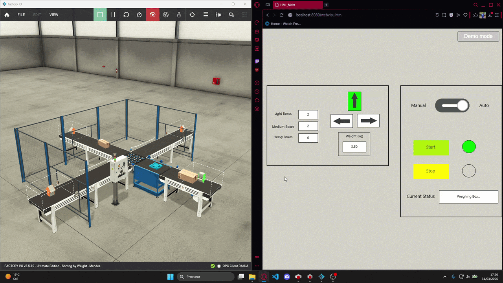

# 📦 Box Weight Sorting System
**PLC: CODESYS V3.5 || Simulation: Factory I/O**

An industrial automation solution for weighing and sorting items in motion. This project focuses on real-time data processing from an analog scale to classify and route boxes based on their mass.

## ⚡ Key Highlights
* **Weight Classification:** Analog load cell integration to distinguish between **Light, Medium, and Heavy** boxes.
* **Tri-Directional Sorting:** Automated routing logic to Left, Right, or Straight conveyors based on real-time scale data.
* **Dual Operation Modes:** Seamlessly synchronized between the physical control panel and a custom HMI.
* **Dynamic HMI Feedback:**
  - Real-time weight display (kg) with 2-decimal precision.
  - Production counters for each weight category.
  - Backlit direction indicators for active conveyors (Left, Right, Forward).
  - Real-time status messages (Weighing, Sorting, Emergency, etc.).
* **Safety Logic:** Integrated Emergency Stop handling with system-ready monitoring and state recovery.

## 🏗️ Technical Setup
* **Logic:** **Structured Text (ST)** for the weighing/sorting state machine + **Ladder Diagram (LD)** for I/O mapping and HMI sync.
* **Data Processing:** Signal scaling and filtering of analog inputs to ensure accurate weight readings.
* **State Management:** Robust transitions using **ENUMs** and **CASE OF** logic to ensure deterministic operation and easy debugging.
* **Data Architecture:** Modular design using custom Function Blocks (FBs), Global Variable Lists (GVLs), and STRUCTs for centralized data.

## 📸 In Action

